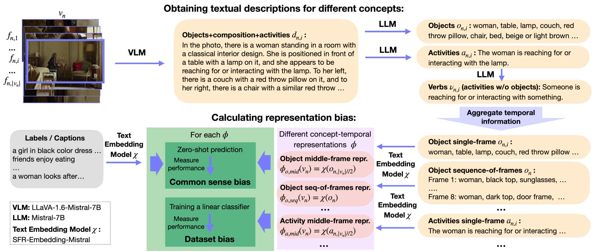

<div align="center">
<h2>Unbiasing through Textual Descriptions: Mitigating Representation Bias in Video Benchmarks</h2>
<h3>CVPR 2025</h3>

<a href="https://ninatu.github.io/">Nina Shvetsova</a>&emsp;
<a href="https://a-nagrani.github.io/">Arsha Nagrani</a>&emsp;
<a href="https://www.mpi-inf.mpg.de/departments/computer-vision-and-machine-learning/people/bernt-schiele">Bernt Schiele</a>&emsp;
<a href="https://hildekuehne.github.io/">Hilde Kuehne</a>&emsp;
<a href="https://chrirupp.github.io/">Christian Rupprecht</a><br>

<a href='https://utd-project.github.io/'></a> &emsp;
<a href='https://arxiv.org/abs/2503.18637'></a> &emsp;
<a href='https://openaccess.thecvf.com/content/CVPR2025/papers/Shvetsova_Unbiasing_through_Textual_Descriptions_Mitigating_Representation_Bias_in_Video_Benchmarks_CVPR_2025_paper.pdf'></a>

<p align="center">
  
</p>
</div>

---

## UTD Dataset

We release the **UTD dataset**. Check the [**project webpage**](https://utd-project.github.io/) to download it. Our UTD dataset includes:

1. **UTD-descriptions**  
   Frame-level annotations for **~2 million videos**, covering four conceptual categories visible in video frames:  
   *objects*, *activities*, *verbs*, and *objects+composition+activities (namely detailed free-form frame descriptions)*.  
   Descriptions are provided for **8 uniformly sampled frames** from the training and test/val splits of 12 widely-used activity recognition and text-to-video retrieval datasets.

2. **UTD-splits**  
   Object-debiased test/val splits for all 12 datasets — subsets in which object-biased samples have been removed. For **6 activity recognition datasets**, we also provide *debiased-balanced splits* that preserve the class distribution while removing the most object-biased samples.

**Included datasets:**

- **Activity recognition**: [UCF101](https://arxiv.org/pdf/1212.0402), [SSv2](https://openaccess.thecvf.com/content_ICCV_2017/papers/Goyal_The_Something_Something_ICCV_2017_paper.pdf),    [Kinetics-400](https://arxiv.org/pdf/1705.06950),    [Kinetics-600](https://arxiv.org/pdf/1808.01340),   [Kinetics-700](https://arxiv.org/pdf/1907.06987), [Moments in Time](https://ieeexplore.ieee.org/stamp/stamp.jsp?arnumber=8651343)

- **Text-to-video retrieval**: [MSR-VTT](https://openaccess.thecvf.com/content_cvpr_2016/papers/Xu_MSR-VTT_A_Large_CVPR_2016_paper.pdf), [YouCook2](http://youcook2.eecs.umich.edu/static/YouCookII/youcookii_readme.pdf),   [DiDeMo](https://openaccess.thecvf.com/content_ICCV_2017/papers/Hendricks_Localizing_Moments_in_ICCV_2017_paper.pdf), [LSMDC](https://openaccess.thecvf.com/content_cvpr_2015/papers/Rohrbach_A_Dataset_for_2015_CVPR_paper.pdf), [ActivityNet Captions](https://openaccess.thecvf.com/content_cvpr_2015/papers/Heilbron_ActivityNet_A_Large-Scale_2015_CVPR_paper.pdf),   [Spoken Moments in Time](https://openaccess.thecvf.com/content/CVPR2021/papers/Monfort_Spoken_Moments_Learning_Joint_Audio-Visual_Representations_From_Video_Descriptions_CVPR_2021_paper.pdf)

👉 **[Download and read more on our webpage](https://utd-project.github.io/).**

---

## Benchmarking Video Models

We benchmarked **30 video models** for action classification and text-to-video retrieval on **12 datasets**, using both original and **UTD-debiased splits**.
We include models from [VideoMAE](https://github.com/MCG-NJU/VideoMAE), [VideoMAE2](https://github.com/OpenGVLab/VideoMAEv2), 
[All-in-one](https://github.com/nextcloud/all-in-one), [Unmasked Teacher (UMT)](https://github.com/OpenGVLab/unmasked_teacher), 
[VideoMamba](https://github.com/OpenGVLab/VideoMamba), and [InternVid](https://github.com/OpenGVLab/InternVideo).

For **action classification**, we follow the [VideoGLUE](https://arxiv.org/abs/2307.03166) setup: using a frozen backbone and training a lightweight pooling head.  
For **text-to-video retrieval**, we report **zero-shot** performance and follow model-specific reranking procedures.

### ⚡ Quick Start

We provide all model predictions to compute accuracy (e.g., Top-1, Recall@1) across splits.

📥 Download predictions into `./videoglue_predictions/`: [**GDrive link.**](https://drive.google.com/drive/folders/1gSXGsmnrASK72jvbbxTQiGkIYmg3lfeR?usp=sharing)

📥 Download UTD splits into `./UTD_splits/` following instructions on our [**project webpage.**](https://utd-project.github.io/)

#### Example: 

Accuracy of `videomae-B-UH` on full test set of `ucf`:
```shell
python utd/videoglue/get_split_results.py \
  --pred_csv videoglue_predictions/ucf_videomae-B-UH/valid_49ep.csv  \
  --splits_path UTD_splits/splits_ucf_testlist01.json \
  --split_name full
```

on our UDT `debiased-balanced` split:

```shell
python utd/videoglue/get_split_results.py \
  --pred_csv videoglue_predictions/ucf_videomae-B-UH/valid_49ep.csv  \
  --splits_path UTD_splits/splits_ucf_testlist01.json \
  --split_name debiased-balanced
```

💡 You can also evaluate on your custom splits by providing a JSON file with the split IDs.

### ⚙️ Benchmarking Setup

#### 🛠️ Environment Setup

We tested env with cuda 11.6 only. Setup cuda path depending on your system (needed for videomamba):
```shell
module load cuda/11.6
```
or
```shell
cuda_version=11.6
export PATH=/usr/lib/cuda-${cuda_version}/bin/:${PATH}
export LD_LIBRARY_PATH=/usr/lib/cuda-${cuda_version}/lib64${LD_LIBRARY_PATH:+:${LD_LIBRARY_PATH}}
export CUDA_PATH=/usr/lib/cuda-${cuda_version}/
export CUDA_HOME=/usr/lib/cuda-${cuda_version}/
```

Create python environment:
```shell
conda create -n videoglue python=3.9 -y
conda activate videoglue
conda install pytorch==1.12.0 torchvision==0.13.0 torchaudio==0.12.0 cudatoolkit=11.6 -c pytorch -c conda-forge -y 
pip install -r requirements_videoglue.txt
cd third_party/VideoMamba
pip install -e causal-conv1d/ # only for videomamba
pip install -e mamba/ # only for videomamba
cd - 
pip install neptune==1.10.1 neptune-tensorboard==1.0.3
pip install -e . 
```

#### 🎬  Download Datasets

Follow [DATASETS.md](DATASETS.md) for instructions on preparing all 12 datasets.

####  💾 Download Models Weights 

Download model weights from official repositories:
[VideoMAE](https://github.com/MCG-NJU/VideoMAE), [VideoMAE2](https://github.com/OpenGVLab/VideoMAEv2), [All-in-one](https://github.com/nextcloud/all-in-one), [UMT](https://github.com/OpenGVLab/unmasked_teacher), [VideoMamba](https://github.com/OpenGVLab/VideoMamba), [InternVid](https://github.com/OpenGVLab/InternVideo)
and store in: `pretrained/{videomae, videomaev2, umt, videomamba, internvid, allinone}`.

> The official checkpoints of **All-in-one** and **InternVid** require some internal dependencies to load.  
> We removed those dependencies and provide the cleaned models here:  
> 🔗 [Cleaned Checkpoints](https://drive.google.com/drive/folders/1kUcPy1oegHvqzo41uf7u4IDadmd5_ZR1?usp=sharing)


#### 🎯 Benchmarking Classification

We follow VideoGLUE to train a light-weight classifier head on frozen video features.

**⚡ Quick Start: Evaluation example (UCF101, VideoMAE-B-K400):**

We release a set of trained light-weight classifiers:  
📥 Download models into `./videoglue_models/`: [**GDrive link.**](https://drive.google.com/drive/folders/1PJxnXReY93rcW8Gwxqt2vGEslJ_LE9aL?usp=sharing)
> **Note:**  `--debiased_splits_path` is optional
> 
```shell
dataset_name='ucf'
prefix='data/UCF101/original/videos/'
data_path='metadata/videoglue/ucf/'
dataset_type='Kinetics_sparse'
debiased_splits_path='UTD_splits/splits_ucf_testlist01.json'
nb_classes=101

backbone_name='videomae-B-K400'
backbone_parameters='--backbone videomae --model vit_base_patch16_224  --num_frames 16 --backbone_checkpoint pretrained/videomae/videomae_checkpoint_pretrain_kin400.pth'

export MASTER_PORT=$((12000 + $RANDOM % 20000))
export OMP_NUM_THREADS=1

export PYTHONPATH="./third_party/:$PYTHONPATH"

output_dir='videoglue_models/' # important for loading checkpoint!!!

srun python utd/videoglue/train_classifier.py \
        ${backbone_parameters} \
        --exp_name ${dataset_name}_${backbone_name}  \
        \
        --data_path ${data_path} \
        --prefix ${prefix} \
        --data_set ${dataset_type} \
        --debiased_splits_path ${debiased_splits_path} \
        --split ',' \
        --nb_classes ${nb_classes} \
        --log_dir 'output/videoglue/logs' \
        --output_dir ${output_dir} \
        \
        --batch_size 64 \
        --val_batch_size_mul 0.5 \
        --num_sample 1 \
        --input_size 224 \
        --short_side_size 224 \
        --num_workers 16 \
        \
        --no_test \
        --dist_eval \
        --enable_deepspeed \
        --layer_decay 1.0 \
        \
        --eval
```

🧪  See [`scripts/eval_classifier.sh`](scripts/eval_classifier.sh) for more examples.


**Training example** (UCF101, VideoMAE-B-K400):
> **Note:**  `--debiased_splits_path` is optional

```shell
# Set neptune.ai keys (optional)
neptune_api_token=''
neptune_project=''

dataset_name='ucf'
prefix='data/UCF101/original/videos/'
data_path='metadata/videoglue/ucf/'
dataset_type='Kinetics_sparse'
nb_classes=101

backbone_name='videomae-B-K400'
backbone_parameters='--backbone videomae --model vit_base_patch16_224  --num_frames 16 --backbone_checkpoint pretrained/videomae/videomae_checkpoint_pretrain_kin400.pth'

export MASTER_PORT=12345
export OMP_NUM_THREADS=1

export PYTHONPATH="./third_party/:$PYTHONPATH"

srun python utd/videoglue/train_classifier.py \
        ${backbone_parameters} \
        --exp_name ${dataset_name}_${backbone_name}  \
        \
        --data_path ${data_path} \
        --prefix ${prefix} \
        --data_set ${dataset_type} \
        --debiased_splits_path UTD_splits/splits_ucf_testlist01.json \
        --split ',' \
        --nb_classes ${nb_classes} \
        --log_dir 'output/videoglue/logs' \
        --output_dir 'output/videoglue/models' \
        \
        --ep 50 \
        --lr 0.001 \
        --weight_decay 0.05 \
        --batch_size 64 \
        --val_batch_size_mul 0.5 \
        --num_sample 1 \
        --input_size 224 \
        --short_side_size 224 \
        --num_workers 16 \
        \
        --aspect_ratio 0.5 2.0 \
        --area_ratio 0.3 1.0 \
        --aa rand-m9-n2-mstd0.5 \
        --reprob 0 \
        --mixup 0.8 \
        --cutmix 1.0 \
        \
        --warmup_epochs 5 \
        --opt adamw \
        --opt_betas 0.9 0.999 \
        \
        --no_test \
        --dist_eval \
        --enable_deepspeed \
        --layer_decay 1.0 \
        \
        --enable_neptune \
        --neptune_api_token ${neptune_api_token} \
        --neptune_project ${neptune_project}
         # disable the last block if you don't want to turn on neptune logging
```

🧪 We use the same hyperparameters across all models/datasets. See [`scripts/train_classifier.sh`](scripts/train_classifier.sh) for more examples.

####  🎯 Benchmarking Retrieval

For text-to-video retrieval, we report **zero-shot** performance and follow model-specific reranking procedures.

Example (msrvtt, umt-b-5M):
> **Note:**  `--debiased_splits_path` is optional

```shell
export PYTHONPATH="./third_party/:$PYTHONPATH"
python utd/videoglue/eval_retrieval.py \
      --backbone_name umt-b-5M \
      --backbone umt \
      --model vit_b16 \
      --backbone_checkpoint pretrained/umt/b16_5m.pth \
      --dataset msrvtt \
      --split test \
      --debiased_splits_path UTD_splits/splits_msrvtt_test.json \
      --dataset_root data/msrvtt/ \
      --dataset_metadata_root  metadata/msrvtt/ \
      --encoder_batch_size 32 --fusion_batch_size 32 \
      --output_root 'output/retrieval'
```

🧪 See [`scripts/evaluate_retrieval.sh`](scripts/eval_retrieval.sh) for commands of all models and dataset.


## 🧠 Unbiasing Through Textual Descriptions

### 🛠️ Set Up Environment

```shell
conda create -n utd python=3.10 -y
conda activate utd
pip install -r requirements_utd.txt
cd third_party/LLaVA
pip install -e . 
cd -
pip install protobuf==4.24.4 ffmpeg-python==0.2.0 scikit-image opencv_python==4.6.0.66 decord==0.6.0 av==10.0.0 sentence-transformers==2.7.0
pip install -e .
```

### ⚡ Quick Start

In our UTD dataset, we provide textual descriptions for all 12 datasets. For a quick start, you can use them to compute common sense representation bias.

📥 Download UTD descriptions into `./UTD_descriptions/` following instructions on our [**project webpage.**](https://utd-project.github.io/)

**Example**: compute common sense bias for MSRVTT (objects, seq_of_f aggregation):
> **Note:**  use `--retrieval` key only for text-to-video retrieval datasets

```shell
dataset="msrvtt"
split="test"
concept="objects"
temporal_aggregation_type="seq_of_f"

python utd/utd/compute_common_sense_bias.py \
  --retrieval \
  --dataset ${dataset} --split ${split} \
  --temporal_aggregation_type ${temporal_aggregation_type} \
  --concept ${concept} \
  --text_descriptions UTD_descriptions/${dataset}_${split}_${concept}.pickle \
  --output_path  output/bias/${dataset}_${split}_${concept}_${temporal_aggregation_type}.csv
```

### 🎬  Download Datasets

Follow [DATASETS.md](DATASETS.md) for instructions on preparing all 12 datasets.

### 📝 Generating Textual Descriptions

We release full code to generate textual descriptions (namely our **UTD-descriptons**) and estimate different types of representation bias.

#### 1️⃣ Generate VLM Descriptions

We use `LLaVA-1.6-Mistral-7B` to generate detailed frame-level descriptions (`objects+composition+activities`), which include objects, composition, relationships, and activities.  
For example, to process the **MSRVTT** test split:
```shell
dataset='msrvtt'
split='test'
dataset_root='data/msrvtt/'
python utd/utd/vlm_descriptions_llava.py \
  --dataset ${dataset} --split ${split} --dataset_root ${dataset_root} --metadata_root metadata/${dataset} \
  --output_path output/UTD_descriptions/${dataset}_${split}_objects+composition+activities.pickle \
```

📜 See commands for all datasets in [`scripts/1_run_vlm.sh`](scripts/1_run_vlm.sh).

> 💡 **Tip**: To efficiently process large splits (e.g., `kinetics_700` train), you can use the `--num_data_chunks` and `--chunk_id` arguments to process only a specific chunk of the input data in each process and run multiple jobs in parallel, each handling a different portion of the data.

#### 2️⃣ Extract Concepts with LLM
Use the LLM to extract individual concepts such as objects, activities, or verbs.

**Step 1: Extract objects or activities:**
```shell
dataset='msrvtt'
split='test'
concept="objects"
#or concept="activities"
python utd/utd/llm_extract_concepts.py  \
  --concept ${concept} \
  --input_description_path output/UTD_descriptions/${dataset}_${split}_objects+composition+activities.pickle \
  --output_path output/UTD_descriptions/${dataset}_${split}_${concept}.pickle \
  --save_raw_llm_output_path output/UTD_descriptions/raw_${dataset}_${split}_${concept}.pickle
```
**Step 2: Extract verbs from raw activities output (without parsing):**
```shell
dataset='msrvtt'
split='test'
concept="verbs"
python utd/utd/llm_extract_concepts.py  \
  --concept ${concept} \
  --input_description_path output/UTD_descriptions/raw_${dataset}_${split}_activities.pickle \
  --output_path output/UTD_descriptions/${dataset}_${split}_${concept}.pickle
```
**Step 3: Generate 15-words summaries of `objects+composition+activities` concise summaries for sequence-level reasoning in `objects+composition+activities` setup:**
```shell
dataset='msrvtt'
split='test'
concept='objects+composition+activities_15_words'
  python utd/utd/llm_extract_concepts.py  \
    --concept ${concept} \
    --input_description_path output/UTD_descriptions/${dataset}_${split}_objects+composition+activities.pickle \
    --output_path output/UTD_descriptions/${dataset}_${split}_${concept}.pickle
```
📜 See commands for all datasets in [`scripts/2_run_llm.sh`](scripts/2_run_llm.sh).

> 💡 **Tip:** To efficiently process large splits (e.g., `kinetics_700` train), you can use the `--num_data_chunks` and `--chunk_id` arguments to process only a specific chunk of the input data in each process and run multiple jobs in parallel, each handling a different portion of the data.

### 📈 Compute Representation Bias

#### 1️⃣ Common Sense Bias

We use [`SFR-Embedding-Mistral`](https://huggingface.co/Salesforce/SFR-Embedding-Mistral) for reasoning over textual descriptions.

**Available concepts:** `objects`, `activities`, `verbs`, `objects+composition+activities`, `objects+composition+activities_15_words`

**Aggregation types:** `middle_f`, `max_score_f`, `avg_over_f`, `seq_of_f`

**Example:** (MSRVTT, `objects`, `seq_of_f`):
> **Note:**  use `--retrieval` key only for text-to-video retrieval datasets

```shell
dataset="msrvtt"
split="test"
concept="objects"
temporal_aggregation_type="seq_of_f"

python utd/utd/compute_common_sense_bias.py \
  --retrieval \
  --dataset ${dataset} --split ${split} \
  --temporal_aggregation_type ${temporal_aggregation_type} \
  --concept ${concept} \
  --text_descriptions output/UTD_descriptions/${dataset}_${split}_${concept}.pickle \
  --output_path  output/bias/${dataset}_${split}_${concept}_${temporal_aggregation_type}.csv
```

📜 See commands for all datasets in `scripts/3_common_sense_bias.sh`

#### 2️⃣ Dataset Bias (Classification Datasets Only)

We compute **dataset bias** as the performance of a linear classifier trained on textual embeddings extracted from the training set.

**Steps:**
1. Extract and save text embeddings
2. Train a linear classifier on those embeddings

📜 See the full pipeline in [`scripts/4_dataset_bias.sh`](scripts/4_dataset_bias.sh)


## 📄 Acknowledgments and Licenses

The code for LLaVA inference is partly derived from [LLaVA](https://github.com/haotian-liu/LLaVA) which is licensed under the **Apache License 2.0**.  
The code in `utd/videoglue` is partly based on [Unmasked Teacher](https://github.com/OpenGVLab/unmasked_teacher) which is licensed under the **MIT License**.
Licenses for third-party code in `./third_party/` are provided in each corresponding subfolder.  
All other code is licensed under the **MIT License**. Full license terms are available in the [`LICENSE`](./LICENSE) file.

## 📚 Citation

If you use this code in your research, please cite:

```
@inproceedings{shvetsova2025utd,
  title     = {Unbiasing through Textual Descriptions: Mitigating Representation Bias in Video Benchmarks},
  author    = {Shvetsova, Nina and Nagrani, Arsha and Schiele, Bernt and Kuehne, Hilde and Rupprecht, Christian},
  booktitle = {Proceedings of the IEEE/CVF Conference on Computer Vision and Pattern Recognition},
  year      = {2025}
}
```